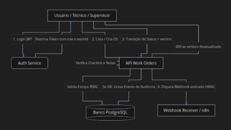

# Fieldops - Gestão de Ordens de Serviço em Campo

> Solução full stack para gestão de ordens de serviço (OS) com controle de acesso por perfil (RBAC), concorrência otimista, auditoria de eventos e disparo de webhooks assinados.

## Tecnologias Utilizadas
- **Frontend:** React, Typescript, Vite, CSS Modules / Vanilla CSS, Lucide React
- **Backend:** Python (FastAPI), SQLAlchemy / SQLModel, Pydantic, Uvicorn, Pytest
- **Banco de Dados:** PostgreSQL
- **DevOps:** Docker, Docker Compose, Github Actions (CI)

## Como Executar o Projeto

### Pré-requisitos
- Docker e Docker Compose instalados ou Node.js (v18+), Python (v3.11+)  e PostgreSQL instalados localmente

### Opção 1: Executando via Docker Compose (Recomendado)
1. Clone o repositório e configure as variáveis de ambiente:
```bash
cp .env.example .env
```

2. Suba todos os containers (Banco, API e Frontend):
```bash
docker compose up --build -d
```

3. Popule o banco de dados com alguns registros para teste (opcional)
```bash
docker compose exec api python seed.py
```

### Opção 2: Executando localmente (Sem Docker para App)
1. Banco de Dados
```bash
# Subir apenas o PostgreSQL via Docker:
docker compose up -d db
```

2. Backend (FastAPI)
```bash
cd api
python -m venv .venv
source .venv/bin/activate  # No Windows: .venv\Scripts\activate
pip install -r requirements.txt
python seed.py             # Popular banco com usuários e dados de teste
uvicorn src.main:app --reload --port 8000
```

3. Frontend (React)
```bash
cd web
npm install
npm run dev
```

4. Executando os Testes Automatizados do Backend
```bash
cd api
source .venv/bin/activate
pytest
```

## Diagrama do fluxo principal


## ADRs (Architectore Decision Records)

#### 1. Controle de Concorrência Otimista
- **Contexto**: Técnicos e Supervisores podem atualizar a mesma OS simultaneamente.
- **Decisão**: Utilização de um campo numérico incremental `version` em cada OS. Ao alterar status, o cliente envia a versão conhecida. Se o registro no banco tiver versão superior, a API rejeita a requisição com status `409 Conflict` e código `FLX_CONCURRENT_UPDATE`.
- **Consequências**: Evita sobreescrita cega de dados sem a necessidade de locks pessimistas que travariam o banco.

#### 2. Isolamento de Escopo e Controle de Acesso (RBAC)
- **Contexto**: Garantir que técnicos não acessem dados de outras equipes ou de outros técnicos.
- **Decisão**: As regras de escopo foram aplicadas diretamente na camada de consulta ao banco de dados da API e no ORM, impedindo que parâmetros na query string burlem o isolamento. Tentativas de acesso a registros fora do escopo retornam `403 Forbidden` (`FLX_FORBIDDEN`).
- **Consequências**: Segurança por design garantida na API, independente das validações visuais no frontend.

#### 3. Webhook Assinado com HMAC-SHA256 e Revisão de APi
- **Contexto**: Notificar sistemas externos após cada transição de status de forma íntegra e segura.
- **Decisão**: Disparo de requisição `POST` com headers `X-Api-Revision: 2026.2` e `X-Signature: <hmac_hex>`, assinando o payload com `WEBHOOK_SECRET`. O payload inclui `eventId`(UUID) para garantir idempotência no receptor.
- **Consequências**: O consumidor pode validar a autenticidade e evitar processamento duplicado de eventos.


## Usuários de seed para Autenticação
| Email                        | Senha         | Role         | teamId       |
| ---------------------------- | ------------- | ------------ | ------------ |
| `tech-a@fieldops.eval`       | `password123` | `technician` | `team-alpha` |
| `tech-b@fieldops.eval`       | `password123` | `technician` | `team-beta`  |
| `supervisor-a@fieldops.eval` | `password123` | `supervisor` | `team-alpha` |
| `admin@fieldops.eval`        | `password123` | `admin`      | —            |


## Limitações conhecidas
- O reenvio automático de webhooks em caso de falha de rede do receptor externo (retry queue com backoff) pode ser expandido com um broker de mensagens (ex: Redis/Celery)
- A criação e exclusão de itens individuais de checklist em uma OS existente após a sua criação inicial é gerenciada pela edição do status de conclusão